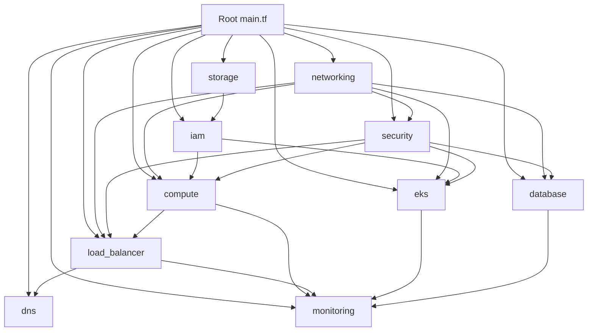

# Complete Terraform Project Folder Structure

## 📁 Final Project Structure

```
aws-terraform-infrastructure/
├── 📄 main.tf                                   # Root module - orchestrates all modules
├── 📄 variables.tf                              # Root variables with all configurable options
├── 📄 outputs.tf                                # Root outputs exposing key resource information
├── 📄 terraform.tf                              # Provider configuration and backend setup
├── 📄 README.md                                 # Comprehensive documentation
├── 📄 FOLDER_STRUCTURE.md                       # This file
│
└── 📁 modules/                                  # All modular components
    │
    ├── 📁 networking/                           # VPC, Subnets, Gateways, Routing
    │   ├── 📄 main.tf                          # VPC, IGW, NAT, Route Tables, Flow Logs
    │   ├── 📄 variables.tf                     # Network configuration variables
    │   └── 📄 outputs.tf                       # VPC, subnet, and gateway outputs
    │
    ├── 📁 security/                             # Security Groups and Rules
    │   ├── 📄 main.tf                          # Security groups for all services
    │   ├── 📄 variables.tf                     # Security configuration variables
    │   └── 📄 outputs.tf                       # Security group IDs and ARNs
    │
    ├── 📁 iam/                                 # IAM Roles, Policies, Instance Profiles
    │   ├── 📄 main.tf                          # IAM resources for EC2, EKS, S3 access
    │   ├── 📄 variables.tf                     # IAM configuration variables
    │   └── 📄 outputs.tf                       # Role ARNs and instance profile names
    │
    ├── 📁 compute/                              # EC2 Instances, Auto Scaling
    │   ├── 📄 main.tf                          # Bastion host, ASG, launch templates
    │   ├── 📄 variables.tf                     # Compute configuration variables
    │   ├── 📄 outputs.tf                       # Instance IDs, ASG ARNs
    │   └── 📁 user_data/                       # Instance initialization scripts
    │       ├── 📄 bastion_user_data.sh         # Bastion host setup script
    │       └── 📄 app_server_user_data.sh      # Application server setup script
    │
    ├── 📁 load_balancer/                       # Application Load Balancer
    │   ├── 📄 main.tf                          # ALB, target groups, listeners, WAF
    │   ├── 📄 variables.tf                     # Load balancer configuration
    │   └── 📄 outputs.tf                       # ALB DNS, target group ARNs
    │
    ├── 📁 eks/                                 # Kubernetes Cluster
    │   ├── 📄 main.tf                          # EKS cluster, node groups
    │   ├── 📄 variables.tf                     # EKS configuration variables
    │   └── 📄 outputs.tf                       # Cluster endpoint, security groups
    │
    ├── 📁 storage/                              # S3 and EBS Storage
    │   ├── 📄 main.tf                          # S3 bucket, EBS volumes, encryption
    │   ├── 📄 variables.tf                     # Storage configuration variables
    │   └── 📄 outputs.tf                       # Bucket ARNs, volume IDs
    │
    ├── 📁 database/                             # RDS Database
    │   ├── 📄 main.tf                          # RDS instance, subnet group, parameters
    │   ├── 📄 variables.tf                     # Database configuration variables
    │   └── 📄 outputs.tf                       # RDS endpoint, credentials location
    │
    ├── 📁 dns/                                 # Route 53 DNS
    │   ├── 📄 main.tf                          # Hosted zone, A records
    │   ├── 📄 variables.tf                     # DNS configuration variables
    │   └── 📄 outputs.tf                       # Zone ID, name servers
    │
    └── 📁 monitoring/                           # CloudWatch Monitoring
        ├── 📄 main.tf                          # Log groups, alarms, metrics
        ├── 📄 variables.tf                     # Monitoring configuration variables
        └── 📄 outputs.tf                       # Log group ARNs, alarm names
```

## 📊 Module Dependencies



## 🔧 Module Responsibilities

### 1. **Networking Module** (`modules/networking/`)
- **Purpose**: Core network infrastructure
- **Resources**: VPC, Subnets, IGW, NAT Gateway, Route Tables
- **Dependencies**: None (foundation module)
- **Outputs**: VPC ID, Subnet IDs, Gateway IDs

### 2. **Security Module** (`modules/security/`)
- **Purpose**: Security groups and network access control
- **Resources**: Security Groups for all services
- **Dependencies**: Networking (VPC ID)
- **Outputs**: Security Group IDs

### 3. **IAM Module** (`modules/iam/`)
- **Purpose**: Identity and access management
- **Resources**: Roles, Policies, Instance Profiles
- **Dependencies**: Storage (S3 bucket ARN for policies)
- **Outputs**: Role ARNs, Instance Profile Names

### 4. **Storage Module** (`modules/storage/`)
- **Purpose**: Data storage solutions
- **Resources**: S3 Bucket, EBS Volumes
- **Dependencies**: None
- **Outputs**: Bucket ARN, Volume IDs

### 5. **Compute Module** (`modules/compute/`)
- **Purpose**: EC2 instances and auto scaling
- **Resources**: Bastion Host, ASG, Launch Templates
- **Dependencies**: Networking, Security, IAM
- **Outputs**: Instance IDs, ASG ARNs

### 6. **Load Balancer Module** (`modules/load_balancer/`)
- **Purpose**: Traffic distribution and SSL termination
- **Resources**: ALB, Target Groups, Listeners
- **Dependencies**: Networking, Security
- **Outputs**: ALB DNS Name, Target Group ARNs

### 7. **EKS Module** (`modules/eks/`)
- **Purpose**: Kubernetes container orchestration
- **Resources**: EKS Cluster, Node Groups
- **Dependencies**: Networking, Security, IAM
- **Outputs**: Cluster Endpoint, Security Groups

### 8. **Database Module** (`modules/database/`)
- **Purpose**: Managed database services
- **Resources**: RDS Instance, Parameter Groups, Secrets
- **Dependencies**: Networking, Security
- **Outputs**: RDS Endpoint, Secret ARNs

### 9. **DNS Module** (`modules/dns/`)
- **Purpose**: Domain name resolution
- **Resources**: Route 53 Hosted Zone, Records
- **Dependencies**: Load Balancer, Compute
- **Outputs**: Zone ID, Name Servers

### 10. **Monitoring Module** (`modules/monitoring/`)
- **Purpose**: Observability and alerting
- **Resources**: CloudWatch Logs, Alarms
- **Dependencies**: All other modules (for monitoring)
- **Outputs**: Log Group ARNs, Alarm Names

## 🎯 Key Features

### ✅ Completed Features

1. **Modular Architecture**: Each service in its own module
2. **Configurable Variables**: Extensive customization options
3. **Security Best Practices**: Least privilege, encryption, network segmentation
4. **High Availability**: Multi-AZ deployment support
5. **Auto Scaling**: Horizontal scaling for compute resources
6. **Monitoring**: Comprehensive CloudWatch integration
7. **Secret Management**: AWS Secrets Manager for sensitive data
8. **Tagging Strategy**: Consistent resource tagging
9. **Documentation**: Comprehensive README and code comments
10. **User Data Scripts**: Automated instance configuration

### 🔧 Customization Points

- **Region and AZs**: Configurable deployment location
- **Instance Types**: Customizable for all EC2 resources
- **Database Engine**: PostgreSQL or MySQL support
- **Storage Options**: S3 lifecycle policies, EBS encryption
- **Security Rules**: Configurable ports and CIDR blocks
- **Scaling Parameters**: Auto Scaling Group limits
- **Monitoring**: Configurable retention and alarm thresholds

### 🚀 Deployment Ready

The configuration is production-ready with:
- Remote state backend support
- Provider version constraints
- Resource dependencies properly managed
- Error handling and validation
- Comprehensive outputs for integration

## 📝 Usage Notes

1. **Prerequisites**: AWS CLI, Terraform >= 1.0, appropriate AWS permissions
2. **Configuration**: Use `terraform.tfvars` for environment-specific values
3. **State Management**: Configure S3 backend for team collaboration
4. **Security**: Review and adjust CIDR blocks and security group rules
5. **Costs**: Monitor resource usage, especially EKS and RDS
6. **Updates**: Test changes in development environment first

This structure provides a solid foundation for AWS infrastructure that can be easily extended and modified as requirements evolve.